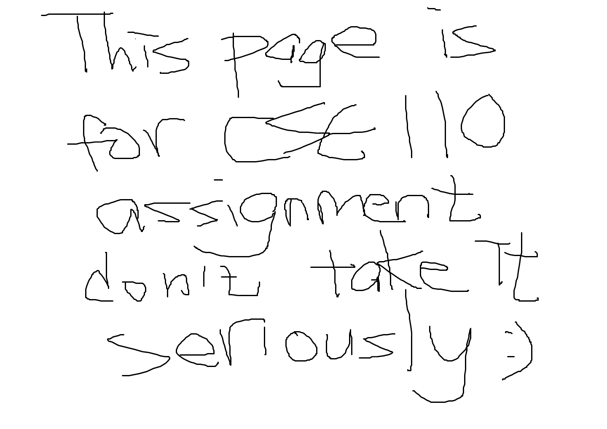

# Bo's User Page
### Table of contents
- [Bo's User Page](#bos-user-page)
    - [Table of contents](#table-of-contents)
  - [Favorite Programming Language](#favorite-programming-language)
  - [Favorite Code segment](#favorite-code-segment)
  - [Favorite Courses](#favorite-courses)
  - [Favorite Brands](#favorite-brands)
  - [Most Recent Drawing](#most-recent-drawing)
  - [TODO](#todo)
  - [My Password](#my-password)
  - [License](#license)

## Favorite Programming Language    
My favorite programming languages are *Python*, *Haskell* and *C++*.\
I **LOVE** *Python* because it is ~~sexy~~ \
I **LOVE** *Haskell* because it is super _cool_\
I **LOVE** *C++* because it is ***fast*** \
<sub><sup>you can't see this but I hate java becuz it is soo slow <sub><sup>


But father of Linux **_Linus Torvalds_** seems not to prefer any of the above. He said this in his interview 
>It's not that I dislike things like perl/python,
it's just that I tend to either just write C,
or do _so_ simple things that shell works fine for me.

## Favorite Code segment
Yes. It is quicksort in Haskell.

```Haskell
quicksort [] = []
quicksort (p:xs) = (quicksort lesser) ++ [p] ++ (quicksort greater)
    where
        lesser = filter (< p) xs
        greater = filter (>= p) xs
```

This is copied from [Haskell Website](https://wiki.haskell.org/Introduction#Quicksort_in_Haskell).

## Favorite Courses
- CSE 100
- CSE 130
- CSE 152A
- CSE 110 (not yet)

## Favorite Brands
1. Coca Cola
2. McDonald's

## Most Recent Drawing


## TODO
- [x] code
- [ ] eat
- [ ] sleep

## My Password
<table>
<thead>
<tr>
<th>1~5</th>
<th>6~10</th>
</tr>
</thead>
<tbody>
<tr>
<td>efref</td>
<td>32r2c</td>
</tr>
</tbody>
</table>

## License
[don't waste your time reading this plz](LICENSE.txt).
